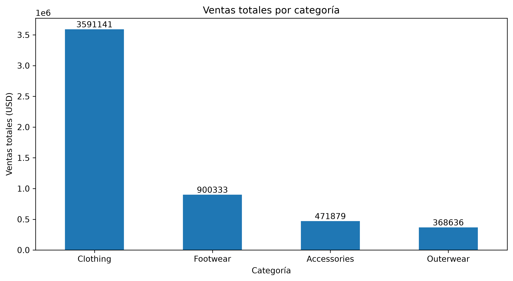
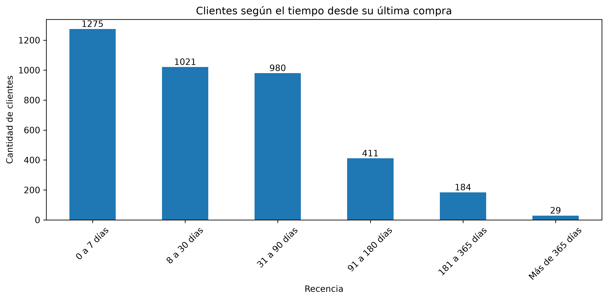
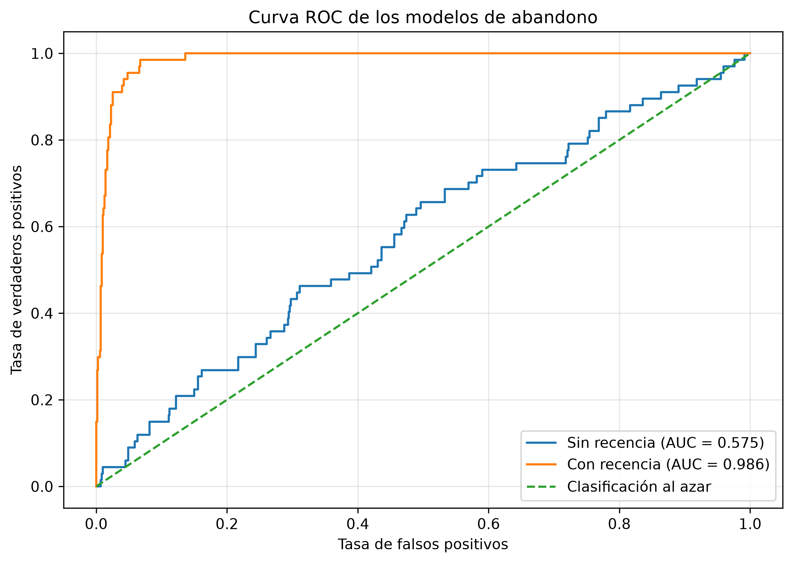

# Customer Analytics

**Proyecto de portfolio de Data Science desarrollado por Paula Ceballos.**

Análisis de datos orientado a estudiar el comportamiento de compra de los clientes de una tienda de ropa, identificar patrones de consumo, segmentar clientes y explorar factores relacionados con el abandono.

### Evolución mensual de las ventas

El siguiente gráfico compara la evolución mensual de las ventas registradas durante 2022, 2023 y 2024, permitiendo observar variaciones y patrones entre los distintos años.

### Ventas por categoría

Este gráfico permite comparar el volumen de ventas correspondiente a cada categoría de producto.

### Recencia de los clientes

Este gráfico muestra cuántos clientes se encuentran en cada intervalo de tiempo desde su última compra, permitiendo identificar grupos con distinto nivel de actividad.

### Comparación de modelos de abandono

La curva ROC permite comparar la capacidad de los modelos para diferenciar entre clientes con y sin riesgo de abandono.

## Tecnologías utilizadas

- Python
- pandas
- NumPy
- Matplotlib
- Seaborn
- scikit-learn
- Jupyter Notebook